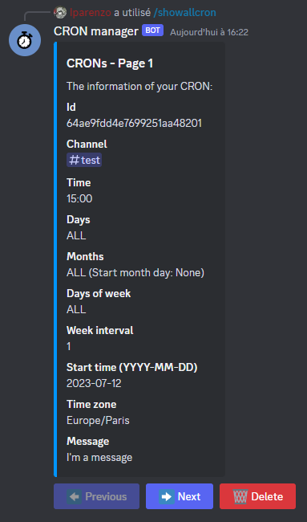
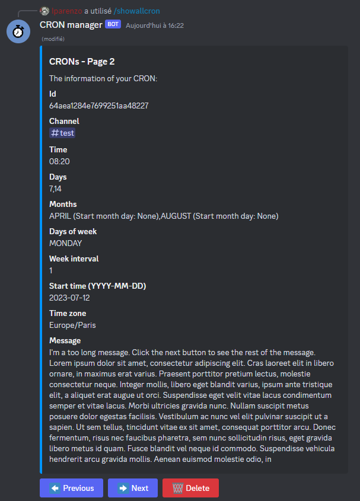
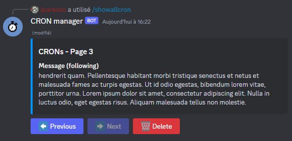

# CRON Manager

CRON Manager is a powerful Discord bot that enables users to effortlessly schedule and automate message sending at customized intervals. Thanks to its large number of options, users can conveniently set up recurring messages, ensuring timely and consistent communication. Say goodbye to manual reminders and let CRON Manager handle your scheduling needs with ease.
 
Is it developed in JavaScript and uses the [Discord.js API](https://discord.js.org/#/). It is combined with a [MongoDB](https://www.mongodb.com/) database to store CRONs of every server using the bot.

## Inviting the CRON Manager BOT to your Discord server

To use my bot, please click on this invitation link and allow the permissions: To do..

> WARNING : Permissions of Administrator are needed to interact with the BOT, take care of not giving them to any user if you don't want them to interact with the BOT.

## How to use the commands

There are a total of six commands available (following [CRUD](https://fr.wikipedia.org/wiki/CRUD) principle) to configure your CRONs and two utility commands. I will detail them for you.

> NOTE: The syntax I will use for the commands are the following:\
> {} = available subcommand(s) | [] = mandatory option(s) | <> = optional option(s). Please do not use these characters: {}, [] and <> in your commands.

### Creating a CRON

To program your first CRON, you will use the `createcron` command. There are three mandatory options for seven optional options.\
```
createcron [channel] [time] [message] <days> <months> <daysOfWeek> <weekInterval> <startTime> <startMonthDay> <timeZone>
```

> NOTE: After the creation, your CRON's data will be shown for two minutes with `Previous` and `Next` buttons to see the complete message if it can't be displayed completely. The `Delete` button allows you to prematurely delete the message (just the display not the actual CRON, if you want to delete the new CRON created please use `deletecron` and `deleteallcron` commands).

#### Options description

- [channel]: The channel (only textual) in which the message you scheduled will be sent. You can only select one channel.\
**Examples:** `#meeting`, `#important`

- [time]: The time when the message will be sent (format: `HH:mm`).\
**Examples:** `12:30`, `00:00`.

- [message]: The message you want to send. Note that you can't send a message with more than 2 000 characters. You can use tags (with the `@`), mention textual channels (with the `#`), use emojis and custom emojis from your server.\
**Example:** `Hello @everyone, let's talk about some crazy stuff in #meeting! 🔥`.

- \<days\>: The specific days of the month you want your message to be sent (`from 1 to 31`). Separate each day you want by commas or put `ALL` if you want all of them. If not specified, it will be sent every day. Note that the `weekInterval` option does not impact this `days` option, if you specified it, in any case, the message will be sent at the days registered.\
**Examples:** `1, 10, 25`, `ALL`.

- \<months\>: The specific months you want your message to be sent (`from January to December`). Separate each month you want by commas or put `ALL`. If not specified, it will be sent every month. If you are using a `weekInterval` greater than 1, you will also need to specify the `startMonthDay` option for each month. Note that you can't specify a `startTime` if you are using `months` with a `weekInterval` greater than 1.\
**Examples:** `September, November, December`, `ALL`.

- \<daysOfWeek\>: The days of the week you want your message to be sent (`from Sunday to Saturday`). Separate each day of the week by commas or put `ALL`. If not specified, it will be sent every day of the week.\
 **Examples:** `Monday, Wednesday, Friday`, `ALL`.

- \<weekInterval\>: The interval of weeks you want your message to be sent. By default, it is set to 1 (sent every week) but you can specify a number to change it. Note that if you are using a `weekInterval` greater than 1 while specifying months, you will need to also use the `startMonthDay` option.\
 **Example:** `2`

- \<startTime\>: The date you want your message to start sending from (format: `YYYY-MM-DD`). By default, it will take the current date of the time zone specified (if you did, if not it will take the Europe/Paris time zone). Note that you can't use this option if you specified `months` with a `weekInterval` greater than 1, you will need to use `startMonthDay`.\
 **Example:** `2023-09-20`

- \<startMonthDay\>: The specified start days of each month from which you want your message to start sending (`from 1 to 5`) where for example 1 means the first day of the week of the month, e.g the first sunday, monday... of the month. For each month you put, you shall add the corresponding starting day all separated by commas. Note that it can only be used if `weekInterval` is greater than 1 and if `months` is used.\
 **Examples:** `1`, `1, 3, 1, 2`

- \<timeZone\>: The time zone you want the message to be sent from. Please use the TZ identifier, you can see a list of them on this [link](https://en.wikipedia.org/wiki/List_of_tz_database_time_zones). By default it is set to Europe/Paris.\
**Example:** `America/Los_Angeles`, `Europe/London`

#### Examples

\
| _Message sent everyday of the year at 14:00 in the channel #test_

\
| _Message sent every day-of-month 1, 10 and 20 at 16:30 in the channel #test_

\
| _Message sent every day of January and September at 09:45 in the channel #test_

\
| _Message sent every Monday and Friday of the year at 02:00 in the channel #test_

\
| _Message sent every day-of-month 15, 20 and 25 of July and December at 00:00 in the channel #test_

\
| _Message sent every day-of-month 24 and every Tuesday at 12:00 in the channel #test_

\
| _Message sent every Thursday and Saturday of March at 19:07 in the channel #test_

\
| _Message sent every day-of-month 7 and 14 of April and August and every Monday of April and August at 08:20 in the channel #test_

\
| _Message sent starting from September 20, 2023 every day-of-month 4 and 17 and every two Monday at 13:15 in the America/Los_Angeles time zone in the channel #test_

\
| _Message sent every two Monday of February and May starting from the first Monday of February and the second Monday of May at 16:34 in the channel #test_

### Seeing all your CRONs

To see all your CRONs, you will use the `showallcron` command. There are no options to fulfil.\
```
showallcron
```

> NOTE: After using the command, all your CRON's data will be shown for two minutes with `Previous` and `Next` buttons to travel between CRONs. If a message of one of your CRONs is too long, just use the `Next` button to see the following of the message. The `Delete` button allows you to prematurely delete the message (just the display not the actual CRON, if you want to delete CRONs please use `deletecron` and `deleteallcron` commands).

#### Examples

`showallcron`

\
| _Informations of one of the CRONs of my server after using the `showallcron` command_

\
| _Informations of another CRON of my server after using the `showallcron` command and clicking the `Next` button_

\
| _Rest of the message of the previous CRON's picture after clicking the `Next` button_

### Seeing one of your CRONs

To see one of your CRONs, you will use the `showcron` command. There is only one mandatory option to fulfil.\
```
showcron [id]
```

> NOTE: After using the command, the specific CRON's data will be shown for two minutes with `Previous` and `Next` buttons to see the complete message if it can't be displayed completely. The `Delete` button allows you to prematurely delete the message (just the display not the actual CRON, if you want to delete CRONs please use `deletecron` and `deleteallcron` commands).

#### Options description

- [id]: The id of the CRON you want to show. The id can be retrieved by using the `showallcron` command.\
**Example:** `64ae9fdd4e7699251aa48201`

#### Examples

`showcron 64ae9fdd4e7699251aa48201`

\
| _Informations of one of the CRONs of my server after using the `showcron` command with the id of this CRON_

### Updating one of your CRONs

To update one of your CRONs, you will use the `updatecron` command. There is one mandatory options for ten optional options.\
```
updatecron [id] <channel> <time> <message> <days> <months> <daysOfWeek> <weekInterval> <startTime> <startMonthDay> <timeZone>
```

#### Options description

- [id]: The id of the CRON you want to update. The id can be retrieved by using the `showallcron` command.\
**Example:** `64ae9fdd4e7699251aa48201`

Please refer to the description of the `createcron` command for all optional options.

#### Examples

\
| _Updating the time the message will be sent of the CRON with id `64ae9fdd4e7699251aa48201`_

Please refer to the examples of the `createcron` command. You can update anything you want except the id.

### Deleting all your CRONs

To delete all your CRONs, you will use the `deleteallcron` command. There are no options to fulfil.\
```
deleteallcron
```

> NOTE: After using the command, all CRONs of your server will be deleted for ever, it is impossible to reverse the action. Please take care.

#### Examples

`deleteallcron`

### Deleting one of your CRONs

To delete one of your CRONs, you will use the `deletecron` command. There is only one mandatory option to fulfil.\
```
deletecron [id]
```

> NOTE: After using the command, the specific CRON will be deleted for ever, it is impossible to reverse the action. Please take care.

#### Options description

- [id]: The id of the CRON you want to delete. The id can be retrieved by using the `showallcron` command.\
**Example:** `64ae9fdd4e7699251aa48201`

#### Example

`deletecron 64ae9fdd4e7699251aa48201`
